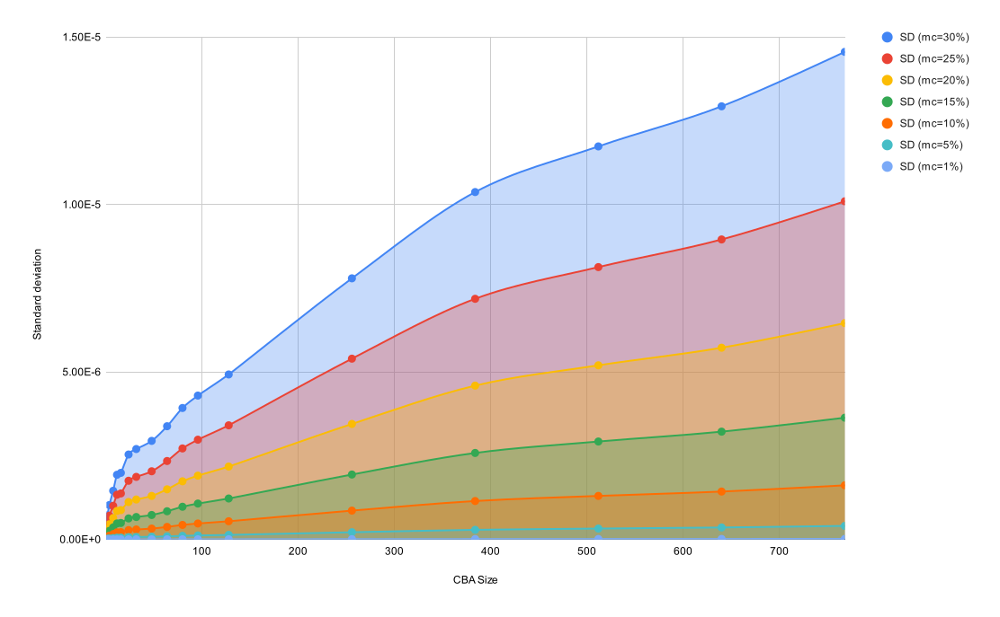
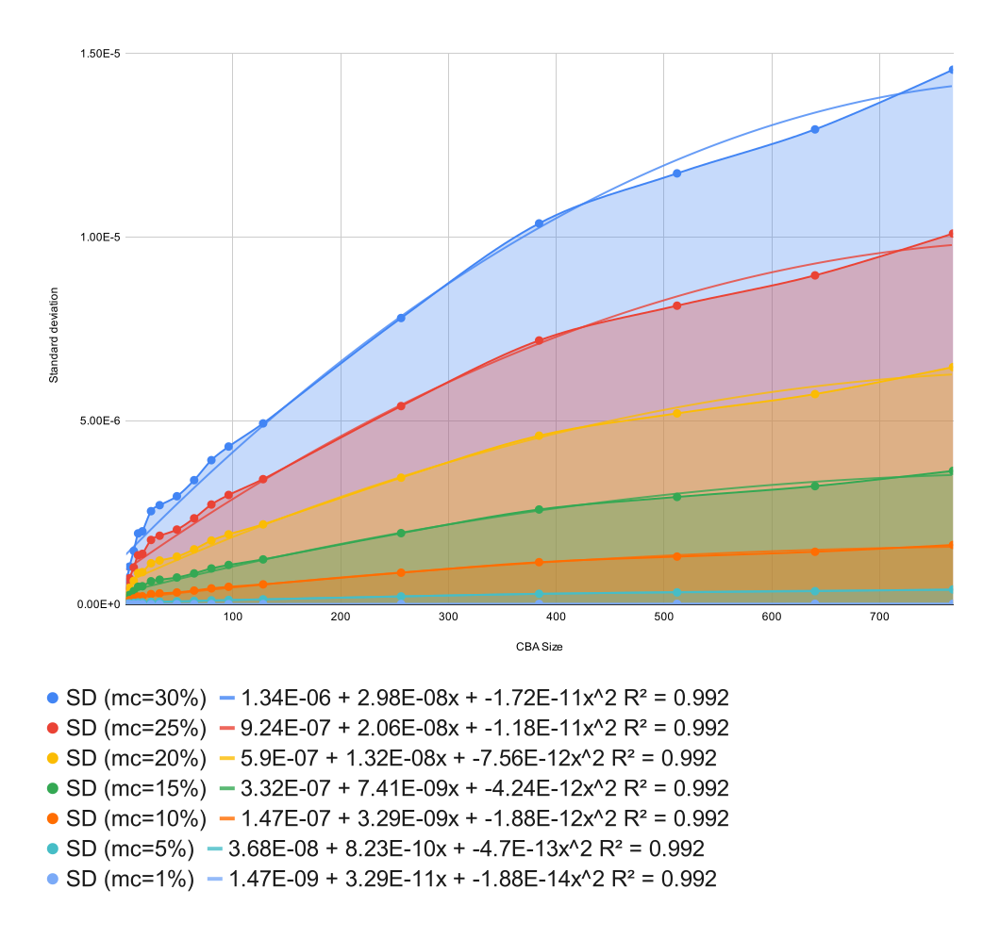

Conduct a noise sensitivity analysis on the crossbar using Monte Carlo.

Generates plots of probability distribution frequency and calculates the the sample mean and standard deviation for different crossbar array sizes.

Run `bash simulate.sh`. Modify accordingly to specify the Monte Carlo gaussian distribution which will be applied on the memristor cell (this simulates the manufacturing tolerance)

Simulation is run for the following parameters:

> Monte Carlo SD (ie. tolerance of the memristive cells)
> - 1%, 5%, 10%, 15%, 20%, 25%, 30%
> 
> CBA Size
> - 1, 2, 4, 8, 12, 16, 24, 32, 48, 64, 80, 96, 128, 256, 384, 512, 640, 768

Results are as follows:

- [results_20230228.zip](./results/results_20230228.zip)

